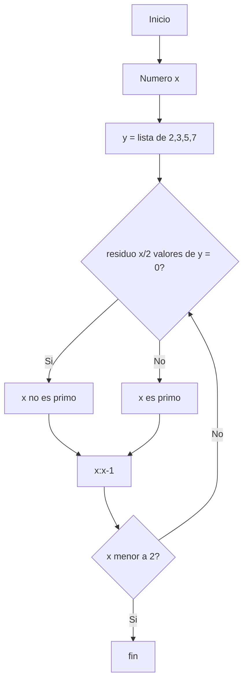
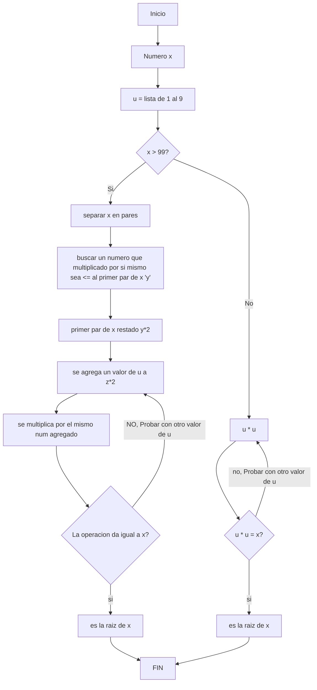

# RETO3
## Pseudocodigo de numeros primos

```pseudocode
	
x : entero
y : lista que contega (2,3,5,7)

inicio
  x := un numero entero
  Mientras (x > 1) hacer
    Si modulo (x,2 valores de y (2,3,5,7) != 0
      escribir ("x es primo")
    sino
      y := y - 1
  fin mientras
fin	  
```
##Diagrama de flujo:


## Pseudocodigo de racies

```pseudocode

x : entero
y : el primer valor de la lista en x
v : los demas valores de x sin y
z : numero mas cercano a y que multiplicado por si mismo sea <= y
w : z * 2
u : lista del 1 al 9
t : entero
r : w agregado y multiplicado por el mismo valor de u

inicio
 Mientras x > 99
   separar x en una lista en pares
     (sacar (z-y) y agregardo v) = t
       si w agregado y multiplicado por el mismo valor de u == t entonces
	 escribir( r "es la raiz de (x))
       sino probar con otro numero de u
         si en ningun valor de u se encuentra
	   escribir (x "no tiene raiz exacta")
 fin para

 Para 1 < x > 100
   si u*u == x
     escribir (s "es raiz de x)  
   sino
     escribir (x "no tiene raiz exacta")
 fin para
Fin	   	

```
## Diagrama de flujo


